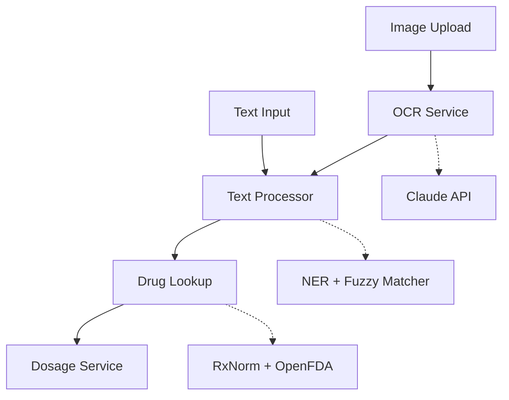

# Pillinfo
### The Problem
Many people struggle to understand the medications they're prescribed or buy over-the-counter. Drug packaging is confusing, medical terminology is intimidating, and medication misuse leads to serious health risks. In regions with limited healthcare access, getting quick and reliable drug information is nearly impossible.

### The Solution
Pillinfo is an AI-powered drug information system that helps users identify medications and understand their proper usage. Users can input a drug name or upload photos of packaging from multiple angles, and the system returns:

### What the drug treats
Proper dosage information
Administration routes and forms
Personalized dosage calculations (based on weight/age)
Safety warnings and restrictions

## The Journey

### The Vision
I set out to build this entire system without relying on LLMs - I wanted to create something using traditional ML models, custom NER extractors, and open-source tools. I spent over a month coding the pipeline from scratch, building modular services that each handled a specific responsibility.

### The Struggle
Everything was coming together beautifully - the NER extraction, fuzzy matching for typo correction, drug lookup, dosage calculations - until I hit the OCR wall.
The free OCR models I tried were either:

Painfully slow (taking 10+ seconds per image on CPU)
Inaccurate (constantly misreading "Tylenol" as "Tyl3nol" or missing "MG/ML" compound units)
Require retraining (which I didn't have time for in the project timeline)

I faced a dilemma: delete a month of work and start over with an LLM-first approach, or find a hybrid solution?
The Solution
I kept all my custom processing logic - the NER extractor, fuzzy matcher, drug lookup service, dosage calculator - and only used Claude's API for the OCR step. This gave me:

Accurate text extraction from pill packaging
Multi-image support so users can photograph all sides of a package
Smart normalization that handles variations like "200mg", "200 MG", "200 mg/ml"

The rest of my pipeline stayed intact - proving that traditional ML + targeted LLM usage can be more powerful than going all-in on either approach.
Technical Challenges Solved

Dosage format matching: Normalizing "200mg" to match "200 MG" in the RxNorm database
Compound units: Handling "40 MG/ML" with spaces and slashes in different positions
Single Responsibility Principle: Keeping each service focused - TextProcessor handles normalization, DrugLookup handles matching, OCRService handles vision
Multi-image processing: Sending all package photos to Claude in one API call for complete context
Smart caching: Reducing API calls by caching common drug lookups

# Architecture

## Tech Stack

Backend:

FastAPI (Python)
Anthropic Claude API (OCR only)
Hugging Face Transformers (Medical NER)
RxNorm API (Drug database)
OpenFDA API (Label information)

ML/NLP:

Custom NER extractor (Clinical-AI-Apollo/Medical-NER)
Fuzzy matching (RapidFuzz)
Regex-based fallback patterns

Image Processing:

Pillow (optimization)
Base64 encoding for API transport

Data Management:

httpx (async API calls)
JSON caching system
Environment-based configuration

## How It Works
Stream 1: Text Input (Fast Lookup)

User types drug name with optional details (e.g., "Advil 200mg oral tablet")
Text Processor extracts entities (drug name, dosage, route, form) using NER + regex
Fuzzy Matcher corrects typos ("Tylen0l" → "Tylenol")
Drug Lookup queries RxNorm database with normalized parameters
Smart Matching refines products based on extracted dosage/route/form
Response returns matched products with safety information

Stream 2: Image Upload (OCR-Based)

User uploads 1-5 images of drug packaging (front, back, sides)
OCR Service processes all images simultaneously with Claude for complete context
Text Processor extracts entities from OCR text using NER + regex
Fuzzy Matcher corrects OCR errors and typos
Drug Lookup queries RxNorm database with normalized parameters
Smart Matching refines products based on extracted dosage/route/form
Dosage Service calculates personalized dosing if weight/age provided
Response returns matched product with detailed safety information

Both streams converge after text extraction, using the same processing pipeline for consistency and reliability.
Key Features
Drug Identification:

Text-based search with fuzzy matching
Multi-image OCR for complete package coverage
Support for brand names and generic names

Information Provided:

Drug purpose and indications
Dosage forms (tablet, capsule, liquid, etc.)
Administration routes (oral, topical, etc.)
Personalized dosage calculations
FDA safety warnings and restrictions

### Smart Matching:

Handles dosage variations (200mg, 200 MG, 200 mg/ml)
Distinguishes between exact and partial matches
Provides guidance when multiple products match

### Optimization:

Caching layer for common drug queries
Async API calls for performance
Image optimization to reduce API costs

### Future Improvements
Train custom OCR model - Replace Claude API by retraining open-source OCR models (Tesseract, EasyOCR) on pharmaceutical packaging dataset to reduce costs and improve speed
Multilingual support - Extend NER models to handle drug names in Spanish, French, Arabic
Voice interface - Add speech-to-text for accessibility
Mobile app - Native iOS/Android apps with camera integration
Drug interaction checker - Warn users about dangerous combinations
Analytics dashboard - Track common queries and improve the model
Healthcare provider integration - Allow doctors to verify patient understanding